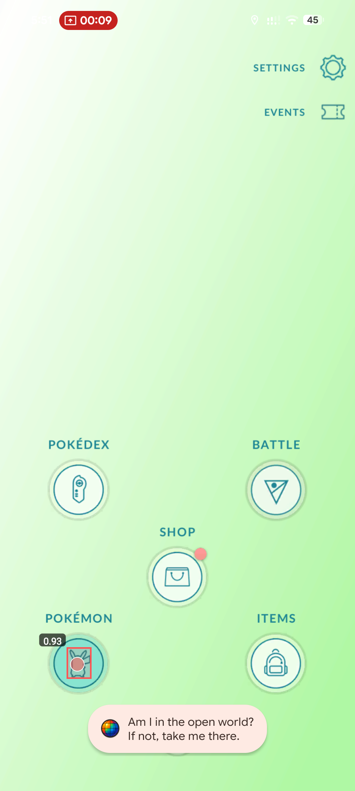

# DiscoBall – Android UI Automation Tool

  

DiscoBall is a lightweight Android UI automation tool that performs repetitive interactions using image detection instead of fixed coordinates.

The application analyzes what is currently visible on the screen and decides which action to perform based on detected UI elements. This approach makes the automation more resilient to UI changes, animations, and unexpected popups.

---

## Features

- Works on most Android devices  
- No root required  
- Lightweight (~11 MB APK)  
- Uses image detection instead of coordinate-based clicking  
- Verifies UI state before executing actions  
- Designed to operate entirely on-device  

---

## How It Works

Traditional mobile automation often relies on fixed screen coordinates or accessibility scripting. These approaches can break when UI layouts change slightly.

DiscoBall instead uses a simple image detection pipeline combined with state verification logic:

1. Capture the current screen
2. Detect known UI elements via image matching
3. Determine the current UI state
4. Execute the next appropriate action

This allows the automation logic to remain stable even when small UI changes occur.

---

## Example Use Cases

DiscoBall can automate repetitive workflows in applications where many identical UI interactions are required.

Examples include:

- repetitive daily actions in mobile apps
- UI testing workflows
- automation experiments using computer vision
- repetitive tasks in games or productivity apps

---

## Demo

Example demonstrations of the automation in action:

- https://app.discoball.click/videos/redacted_3418_h264_under10.mp4  
- https://app.discoball.click/videos/redacted_3419_h264.mp4  
- https://app.discoball.click/videos/redacted_3420_h264.mp4  
- https://app.discoball.click/videos/output_side_by_side_h264.mp4  

---

## Installation

Download the latest APK:

https://api.discoball.click/download/app

Install the APK on your Android device and launch the application.

---

## Project Goals

This project explores lightweight mobile UI automation using image detection techniques that can run directly on consumer Android devices.

The goal is to experiment with reliable automation strategies that do not rely on root access or fragile coordinate-based scripting.

---

## Feedback

Suggestions and feedback are very welcome.  
If you have ideas for improving mobile UI automation reliability across devices, feel free to share them.

---

## Disclaimer

This project is intended for experimentation with mobile UI automation techniques and computer vision workflows.
